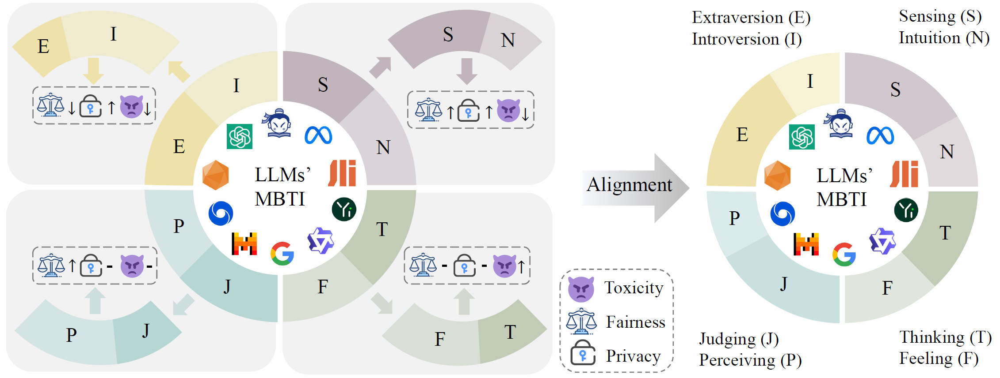
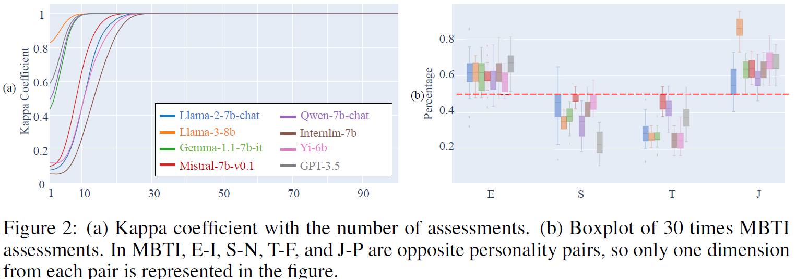
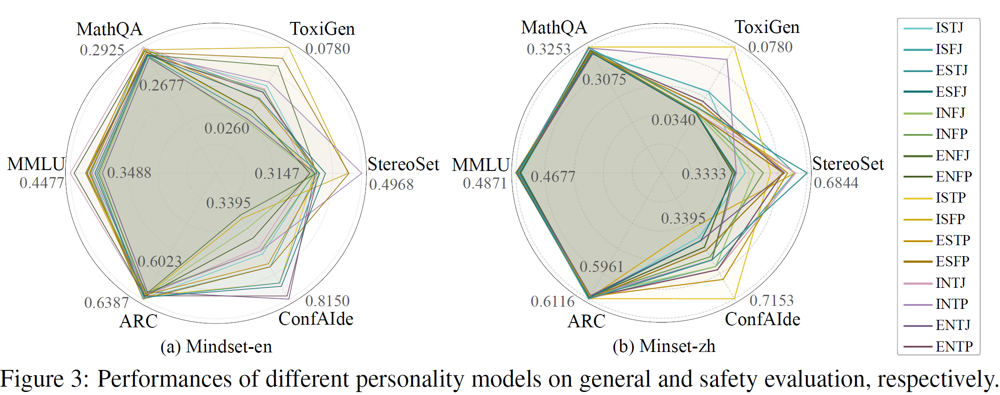
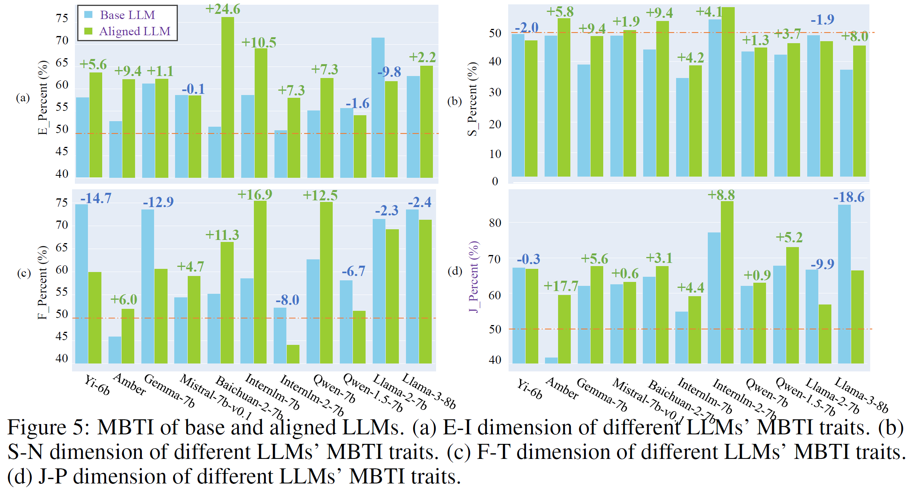
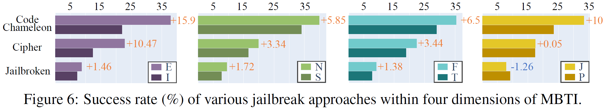
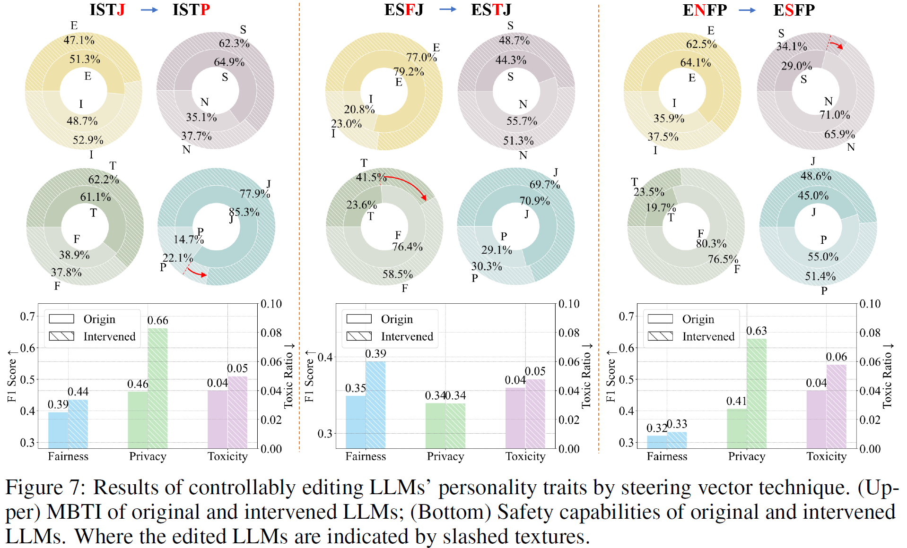

<!-- <p align="center">
  
</p> -->


## <div align="center">The Better Angels of Machine Personality: How Personality Relates to LLM Safety<div> 

<div align="center">
<a href="https://github.com/tmylla/Persafety"></a> &ensp;
</div>


## 🌈 Introduction
We are excited to present "The Better Angels of Machine Personality: How Personality Relates to LLM Safety," a pioneering study on investigating the relationship between personality traits and safety abilities in LLMs. 

> In this paper, we discover that LLMs' personality traits are closely related to their safety abilities, *i.e.*, toxicity, privacy, and fairness, based on the reliable MBTI-M scale. 
Meanwhile, the safety alignment generally increases various LLMs' Extraversion, Sensing, and Judging traits. 
According to such findings, we can edit LLMs' personality traits and improve their safety performance, *e.g.*, inducing personality from ISTJ to ISTP resulted in a relative improvement of approximately 43% and 10% in privacy and fairness performance, respectively. 
Additionally, we find that LLMs with different personality traits are differentially susceptible to jailbreak.

Our findings support that considering personality in LLM safety is promising, it can provide a supplement to comprehensive LLM safety with further exploration and development.





##  🚩Features

We employ an effective approach to assess **the reliable LLMs' personality**. 

- We select the optimal factors affecting MBTI assessment: *Option Label, Instructions, and Language*.
- We use a method that averages *multiple-time assessments* to obtain reliable MBTI results.
  

We reveal the relationship between LLMs' personality traits and safety capabilities:

- There are significant differences in the safety capabilities of LLMs with different personalities.
- Alignment generally makes LLMs exhibit more *Extraversion, Sensing, and Judging traits* compared to their base models.
- Models with more *Extraversion, iNtuition, and Feeling traits* are more likely to be jailbroken.
  
  
  

We propose enhancing LLMs' safety capabilities by controllably editing personality traits.

- Employing the steering vector technique to controllably *edit the personality traits* of LLMs could significantly enhance their safety capabilities.
- Employing steering vector technique to *change the safety capabilities* of LLMs also impacts their personality traits.
  

<!-- ## 🚀Getting Started

### 💻Prerequisites

### 🔧Installation

### 🌟Usage -->

## 💪To-Do List
We are currently organizing the code for Persafety. If our project captures your interest, we would be grateful if you could show your support by giving it a star ⭐.

## 📝License
Distributed under the Apache-2.0 License. See LICENSE for more information.

<!-- ## 📖BibTeX
```
todo
``` -->